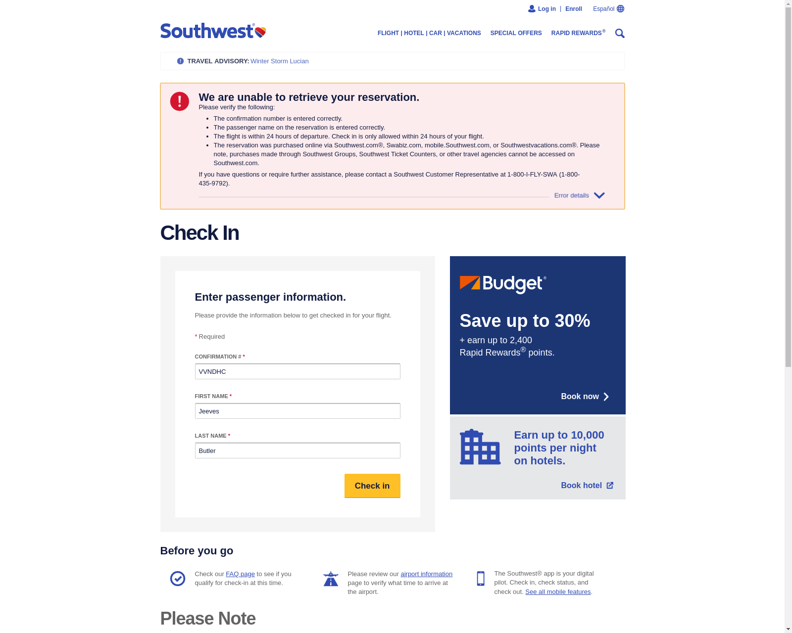

# SWA CheckIn

Automate the Southwest Airlines Check-In process!

<p>
  
</p>

Uses a headless chrome browser and optionally emails you a screenshot of the result (hopefully a successful check-in)

- [Debian/Ubuntu Setup](#installation)
    - [Ruby](#installation-ruby)
    - [Chrome](#installation-chrome)
    - [Chromedriver](#installation-chromedriver)
    - [Environment](#installation-environment)
- [Run](#run)
- [Schedule](#schedule)

# <a name="installation"></a>Debian/Ubuntu Installation

### <a name="installation-ruby"></a>Ruby

Install `ruby (2.5.1)` using your preferred installer/manager. (I heavily recommend [RVM](http://rvm.io/))

Then run

```
gem install bundler
bundle install
```

### <a name="installation-chrome"></a>Chrome

Install latest Google Chrome

```
# Install latest Google Chrome
sudo apt-get install libxss1 libappindicator1 libindicator7
wget https://dl.google.com/linux/direct/google-chrome-stable_current_amd64.deb

sudo dpkg -i google-chrome*.deb
sudo apt-get install -f

# Install xvfb so we can run Chrome headlessly
sudo apt-get install xvfb

# Cleanup
rm google-chrome-stable_current_amd64.deb
```

### <a name="installation-chromedriver"></a>Chromedriver

`chromedriver` is used to drive the headless browser.

`chromedriver` versions are very specificly tied to Google Chrome versions. To determine the correct `chromedriver` version to install:

1. Check your version of Google Chrome with `google-chrome-stable --version`
2. Scan [this unorganized list of chromedriver versions](http://chromedriver.storage.googleapis.com/). Find the closest possible version to the Google Chrome version without exceeding it.

```
sudo apt-get install unzip

# Install `chromedriver`. Insert the version determined above
wget -N http://chromedriver.storage.googleapis.com/72.0.3626.7/chromedriver_linux64.zip

# Extract and make it executable
unzip chromedriver_linux64.zip
chmod +x chromedriver

# Make it available in various PATH locations
sudo mv -f chromedriver /usr/local/share/chromedriver
sudo ln -s /usr/local/share/chromedriver /usr/local/bin/chromedriver
sudo ln -s /usr/local/share/chromedriver /usr/bin/chromedriver

# Cleanup
rm chromedriver_linux64.zip
```

### <a name="installation-environment"></a>Environment

The script relies on several Environment variables to exist. To make defining these easier, you can fill out the provided sample environment config file.

```
cp .env.sample .env

# Open up `.env` and follow the instructions
vi .env
```

# <a name="run"></a>Run

To run the script:

```
./swa.rb
```

For a full list of options:

```
./swa.rb --help
```

# <a name="schedule"></a>Schedule

Of course, you'll probably want to schedule the script so you can have it run at a specific time and check in for you.

If you're using `cron` you can easily schedule it as follows.

```
# Be sure to replace `someuser`, the `/path/to/*`, and the cron timing.
00 00 00 00 * (env && /path/to/ruby /path/to/swa.rb) > /home/someuser/cron.log 2>&1
```

Notes:

- `cron` loads with no knowledge about your environment. See [this post](https://stackoverflow.com/a/23523156/2490003) on how to run ruby scripts in cron sessions. It was written with `rvm` in mind but can be adapted to `rbenv` and other tools
- The above crontab entry prints out the `env` and logs everything to a logfile as a useful debugging tool
- In general, you may find it useful to [enable system wide cron logging](https://stackoverflow.com/a/34872041/2490003) as well.
